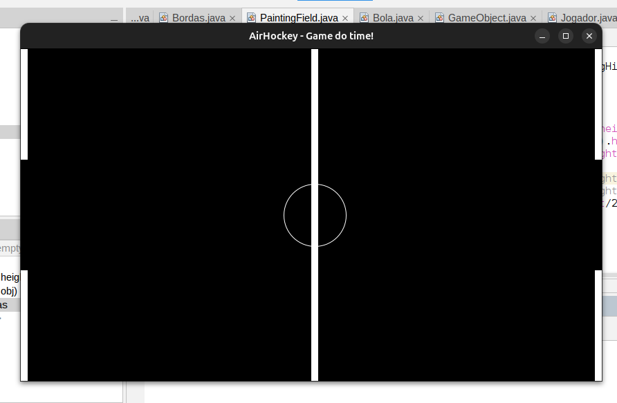

# air-hockey-em-java
A gente vai desenvolver uma versão simples do jogo "Air Hockey" em JAVA e vai aperfeiçoando ele com o tempo adicionando mais funcionalidades se necessário.

### Demo image

This code creates 300.000 cubes using instancing.

